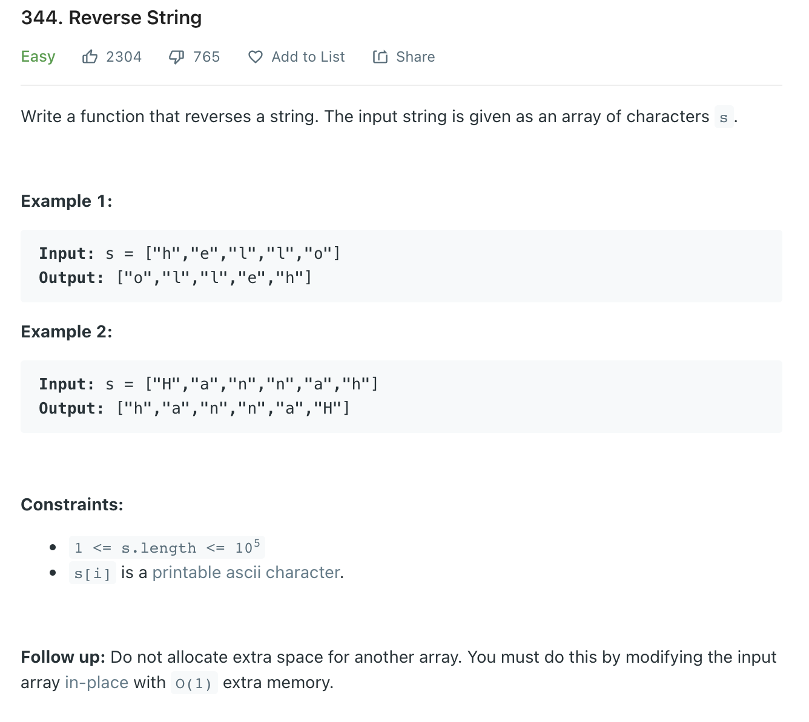

# 02 문자열 뒤집기

<https://leetcode.com/problems/reverse-string/>



## 풀이1

```python

# swap
class Solution1:
    def reverseString(self, s: List[str]) -> None:
        left, right = 0, len(s)-1
        while left<right :
            s[left],s[right] = s[right],s[left]
            left += 1
            right -= 1
```

## 풀이2

```python

class Solution2:
    def reverseString(self,s: List[str]) -> None:
        s.reverse()
```
