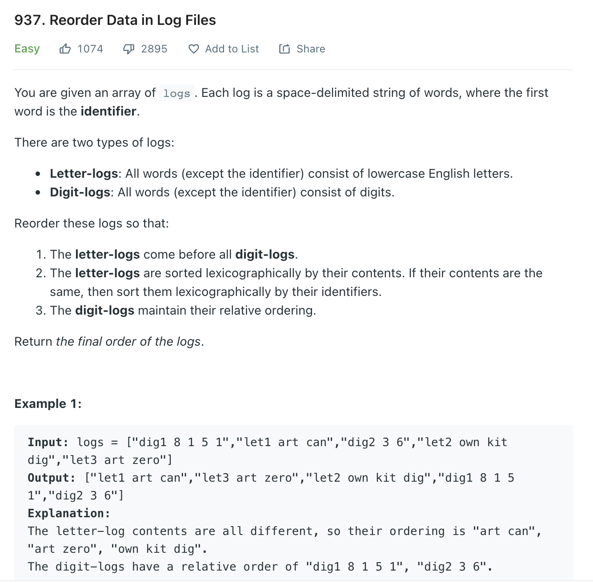

# 03 로그 파일 재정렬

<https://leetcode.com/problems/reorder-data-in-log-files/>



- 로그의 가장 앞부분은 *식별자*
- **문자 로그**는 **숫자 로그**보다 앞에 온다.
- **숫자 로그**는 입력 순서대로
- *식별자*는 순서에 영향이 없지만, 문자가 같은경우 *식별자* 순으로 한다.

## 풀이

```python

class Solution:
     def reorderLogFiles(self, logs: List[str]) -> List[str]:
         dig, let = [],[]
        

        for log in logs:
            if log.split()[1].isdigit(): 
                 dig.append(log)
            else:
                let.append(log)

        # 숫자로그는 입력 순서대로 정렬하기 때문에,
        # 반복문 돌면서 식별자 짜르고 숫자이면 dig 리스트에 추가
        # 문자로그면 let 리스트에 추가

        let.sort(key=lambda x:(x.split()[1:],x.split()[0]))
        
        # 문자 로그는 x.split()[1:](식별자를 제외한 문자열)을 키로 하여,
        # 동일한 경우 후순위로 x.split()[0](식별자)를 지정하여 정렬

        return let+dig

        # 문자 로그가 숫자 로그보다 앞에 오기때문에 let + dig
