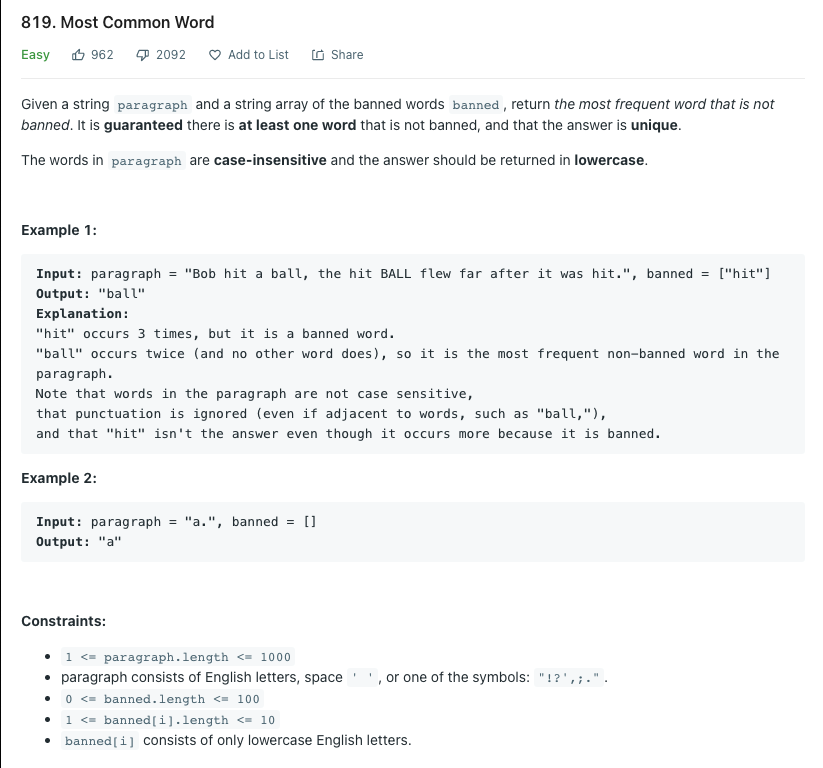

# 04 가장 흔한 단어

<https://leetcode.com/problems/most-common-word/>



- 대소문자 구분 X
- 구두점(마침표,쉼표 등) 무시

## 풀이

```python

class Solution:
    def mostCommonWord(self, paragraph: str, banned: List[str]) -> str:

        # 정규 표현식을 이용하여 paragraph를 소문자 단어 단위로 짜르고, banned에 해당 단어가 없다면, 배열에 추가한다.
        words = [word for word in re.sub(r'[^\w]',' ',paragraph).lower().split() if word not in banned]
        
        # 카운터를 이용하여 단어가 몇번 나왔는지 조회할 수 있다.
        counted = collections.Counter(words)

        # 가장 많이 나온 단어를 return
        return counted.most_common(1)[0][0]
```

## 느낀점

정규 표현식에 대한 이해 필요, 요소의 갯수를 파악할때 counter를 유용하게 사용 가능
