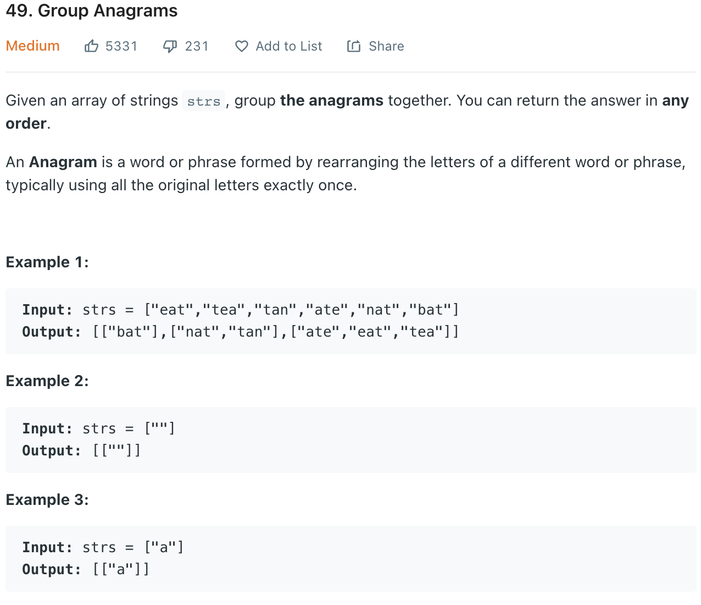

# 05 그룹 애너그램

<https://leetcode.com/problems/group-anagrams/>



## 풀이

```python

class Solution:
    def groupAnagrams(self, strs: List[str]) -> List[List[str]]:

        # KeyError 방지를 위해 항상 디폴트를 생성해주는 defaultdict() 선언
        anagrams = collections.defaultdict(list)

        # strs의 매 단어마다, 정렬한 단어를 키로 하고, 단어를 value 로 하여 딕셔너리에 추가
        # 정렬한 단어를 키로 하면, 각각의 다른 word들을 value로 하여 딕셔너리에 담을 수 있다.
        for word in strs:
            anagrams[''.join(sorted(word))].append(word)

        # value들을 return한다.
        return anagrams.values()
```

## 느낀점

join() 함수에 대한 이해 : join() 은 구분자로 요소를 붙여서 리턴

```python

# example

>>> ' '.join('jegyun')
'j e g y u n'

>>> ','.join('jegyun')
'j,e,g,y,u,n'
```

여기서 ' ' 공백과 , 쉼표가 구분자가 되어 'jegyun' 문자열의 각 요소 뒤에 붙여서 리턴해준다.
